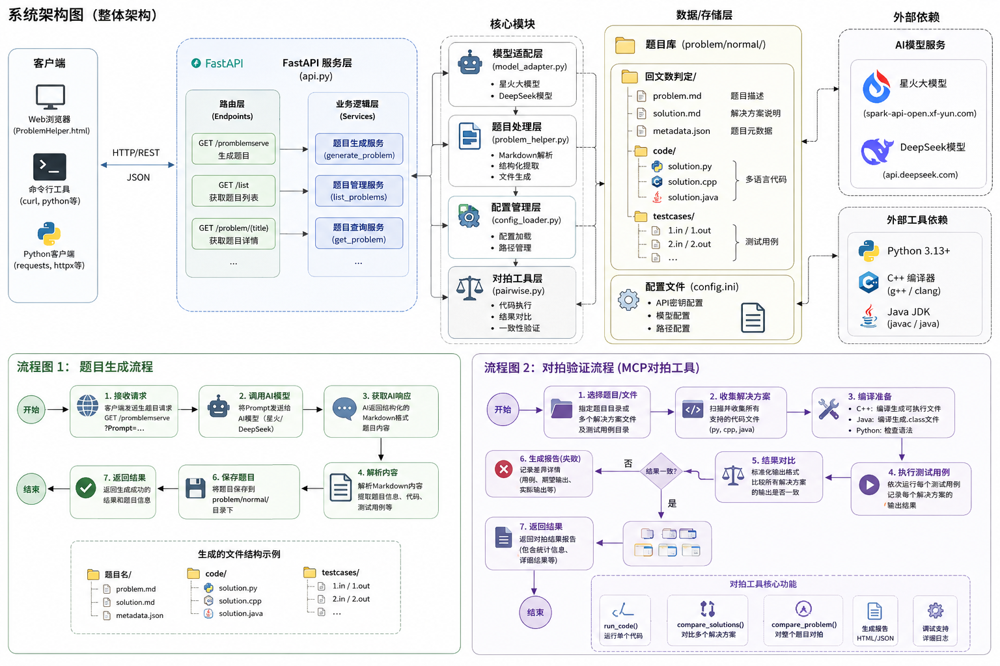
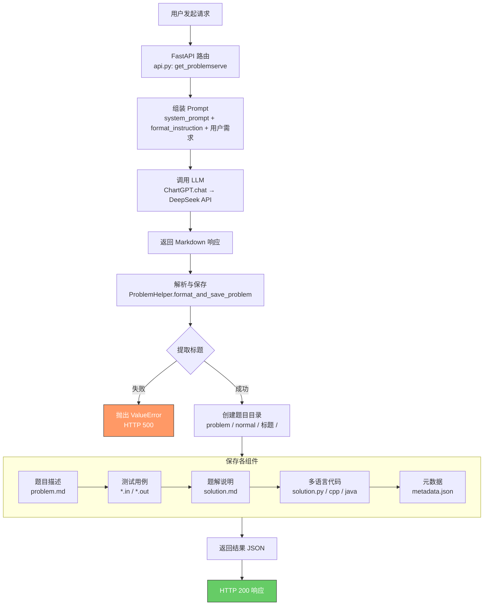

<p align="center">
  
</p>

<h1 align="center">ACMFlow</h1>

<p align="center">
  <a href="https://www.python.org/"></a>
  <a href="https://fastapi.tiangolo.com/"></a>
  <a href="LICENSE"></a>
</p>

<p align="center">
  AI 驱动的 ACM 算法题目生成系统。输入自然语言描述，自动生成包含题目描述、多语言题解代码、测试用例和元数据的完整题目包。
</p>

<p align="center">
  
</p>

---

## 核心特性

- **AI 题目生成** — 接入星火 / DeepSeek 大模型，通过自然语言 Prompt 生成标准 ACM 题目
- **结构化解析** — 自动解析 Markdown 响应，提取题目描述、输入输出格式、样例和测试用例
- **多语言题解** — 同时生成 Python、C++、Java 三种语言的可运行代码
- **对拍验证** — 交叉验证不同语言实现的一致性，确保题解正确
- **REST API** — 基于 FastAPI 的 HTTP 服务，开箱即用

---

## 项目结构

```
CreateProblemAPI/
├── main.py                             # 服务启动入口
├── config.ini                          # 配置文件（API 密钥、Prompt 模板）
├── pytest.ini                          # Pytest 配置
├── .githooks/                          # Git 提交前检查
│   └── pre-commit                      # flake8 + pytest 检查
│
├── src/create_problem_api/
│   ├── api.py                          # FastAPI 路由
│   ├── model_adapter.py                # LLM 适配层（Spark / DeepSeek）
│   ├── problem_helper.py               # Markdown 解析与文件落盘
│   ├── pairwise.py                     # 对拍验证工具
│   └── config.py                       # 配置加载
│
├── tests/
│   ├── parser_smoke.py                 # 解析器冒烟测试
│   └── test_pairwise.py                # 对拍工具集成测试
│
├── scripts/
│   └── pairwise_quick_demo.py          # 对拍快速演示
│
├── problem/normal/                     # 生成的题目库
│   └── <题目名称>/
│       ├── problem.md                  # 题目描述
│       ├── solution.md                 # 题解说明
│       ├── metadata.json               # 元数据
│       ├── code/                       # 多语言代码
│       └── testcases/                  # 测试用例 (*.in / *.out)
│
├── front/                              # Web 前端
├── docs/                               # 设计文档
└── .github/workflows/                  # CI 配置
```

---

## 项目架构图

<p align="center">
  
</p>

---

## 快速开始

### 1. 环境要求

- Python 3.13+
- （可选）C++ 编译器 `g++`、JDK — 用于对拍验证 C++ / Java 代码

### 2. 安装

```bash
git clone <repo-url>
cd CreateProblemAPI

# 创建并激活虚拟环境
python -m venv .venv
source .venv/bin/activate   # Linux / Mac
# .venv\Scripts\activate    # Windows Git Bash

# 安装依赖
pip install fastapi uvicorn openai requests httpx pytest pytest-asyncio flake8
```

### 3. 配置

编辑 `config.ini`，填入 API 密钥：

```ini
[spark]
api_key = your_spark_api_key
base_url = https://spark-api-open.xf-yun.com/v2

[deepseek]
api_key = your_deepseek_api_key
base_url = https://api.deepseek.com
model = deepseek-v4-flash

[save_path]
normal = ./problem/normal
```

> ⚠️ `config.ini` 包含密钥，请勿提交到版本控制。

### 4. 配置 Git Hook（推荐）

```bash
git config core.hooksPath .githooks
```

提交前自动执行 flake8 语法检查 + pytest 测试。

### 5. 启动

```bash
python main.py
# 服务启动在 http://127.0.0.1:9202
# 测试页面: http://127.0.0.1:9202/
```

---

## API

### 生成题目

```http
GET /promblemserve?Prompt=<题目描述>
```

**请求示例**

```http
GET http://127.0.0.1:9202/promblemserve?Prompt=生成一个回文数判定的算法题
```

**响应**

```json
{
  "save_result": {
    "status": "success",
    "message": "题目 '回文数判定' 保存成功",
    "path": "problem/normal/回文数判定",
    "title": "回文数判定",
    "testcase_count": 10,
    "code_file_count": 3
  },
  "status": "success"
}
```

### 获取毒鸡汤

```http
GET /oneup
```

---

## 对拍验证

验证同一题目的多种语言实现是否输出一致。

```python
import asyncio
from src.create_problem_api.pairwise import compare_problem, compare_solutions, run_code

# 运行单个代码文件
result = await run_code("problem/normal/回文数判定/code/solution.py", "121")
print(result["output"])  # True

# 对拍多个代码文件
result = await compare_solutions(
    ["problem/normal/回文数判定/code/solution.py",
     "problem/normal/回文数判定/code/solution.cpp"],
    "problem/normal/回文数判定/testcases"
)
print(f"通过: {result['passed']}")

# 对拍整个题目目录
result = await compare_problem("problem/normal/回文数判定")
print(f"全部通过: {result['passed']}")
```

### 支持的语言

| 语言 | 扩展名 | 运行要求 |
| :--- | :--- | :--- |
| Python | `.py` | Python 3.13+ |
| C++ | `.cpp` | g++ |
| Java | `.java` | JDK 8+ |

---

## 测试

```bash
# 解析器冒烟测试
python tests/parser_smoke.py

# 对拍集成测试
pytest tests/test_pairwise.py -v

# 运行全部测试
pytest
```

---

## 输出格式

每个生成的题目包含以下文件：

```
problem/normal/<题目名称>/
├── problem.md           # 题目描述、输入/输出格式、样例、数据范围
├── solution.md          # 解题思路、算法复杂度分析、题解
├── metadata.json        # 元数据（难度、标签、时间限制等）
├── code/
│   ├── solution.py      # Python 题解
│   ├── solution.cpp     # C++ 题解
│   └── solution.java    # Java 题解
└── testcases/
    ├── 1.in / 1.out     # 测试用例
    └── ...
```

`metadata.json` 示例：

```json
{
  "title": "回文数判定",
  "created_at": "2026-05-13T12:00:00",
  "difficulty": "简单",
  "tags": ["算法基础"],
  "time_limit": "1s",
  "memory_limit": "256MB",
  "source": "AI生成",
  "testcase_count": 10
}
```

---

## 生成流程



---

## 架构

```
用户 Prompt (GET /promblemserve?Prompt=...)
  → api.py — FastAPI 路由，组装 Prompt
  → model_adapter.py — 调用 Spark / DeepSeek API
  → problem_helper.py — 解析 Markdown，落盘文件
  → problem/normal/<题目名称>/
```

---

## 相关文档

- [CLAUDE.md](CLAUDE.md) — 本地开发指南
- [docs/HARNESS_ENGINEERING.md](docs/HARNESS_ENGINEERING.md) — 架构设计文档
- [PAIRWISE_TOOL.md](PAIRWISE_TOOL.md) — 对拍工具使用指南

---

## 许可证

MIT License
